# AIライフコーチ ユーザーマニュアル

> このマニュアルはPlaywrightにより自動生成されたスクリーンショットを元に作成されています。
> 画面上の赤い枠線とラベルが、各機能の場所を示しています。

## 目次

1. [はじめに](#1-はじめに)
   - [ランディングページ](#ランディングページ)
   - [ログインページ](#ログインページ)
2. [オンボーディング](#2-オンボーディング)
   - [ステップ1: ウェルカム](#ステップ1-ウェルカム)
   - [ステップ2: 目的選択](#ステップ2-目的選択)
   - [ステップ2: 目的を選択した状態](#ステップ2-目的を選択した状態)
   - [ステップ3: 価値観インタビュー](#ステップ3-価値観インタビュー)
   - [ステップ4: 動機の深掘り](#ステップ4-動機の深掘り)
   - [ステップ5: 完了](#ステップ5-完了)
3. [メイン機能](#3-メイン機能)
   - [ダッシュボード](#ダッシュボード)
4. [コーチング](#4-コーチング)
   - [コーチングトップ](#コーチングトップ)
   - [チャット画面](#チャット画面)
5. [習慣管理](#5-習慣管理)
   - [習慣一覧](#習慣一覧)
   - [新規習慣作成](#新規習慣作成)
6. [進捗確認](#6-進捗確認)
   - [進捗ページ](#進捗ページ)
7. [設定](#7-設定)
   - [設定ページ](#設定ページ)
   - [プロフィール編集](#プロフィール編集)

---

## 1. はじめに

### ランディングページ

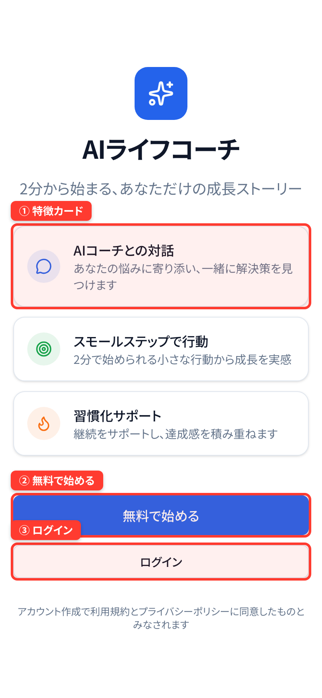

- ① **特徴カード**: アプリの3つの特徴（AIコーチとの対話・スモールステップ・習慣化サポート）が表示されます
- ② **「無料で始める」ボタン**: タップするとオンボーディングに進みます
- ③ **「ログイン」ボタン**: 既存アカウントでログインします

### ログインページ

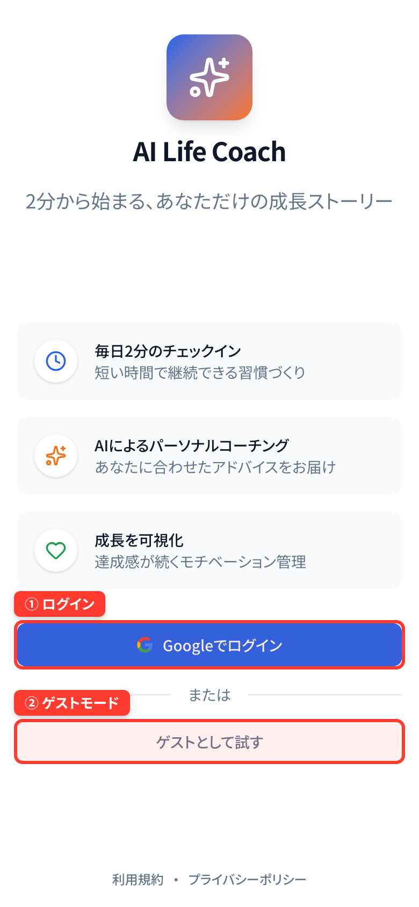

- ① **ログインボタン**: メールアドレスとパスワードを入力してログインします
- ② **ゲストモード**: アカウントなしでお試し利用できます

## 2. オンボーディング

### ステップ1: ウェルカム

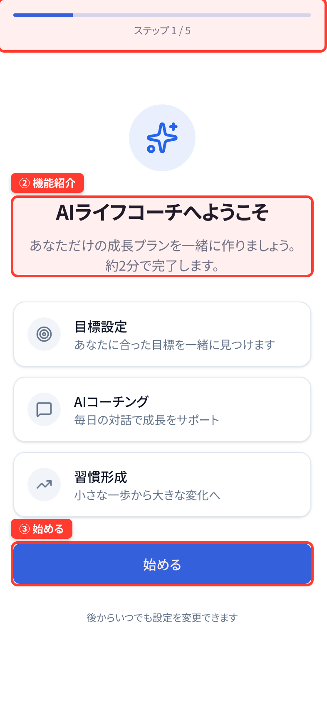

- ① **進行状況バー**: 全5ステップの進捗を示します
- ② **機能紹介カード**: 目標設定・AIコーチング・習慣形成の3つの特徴
- ③ **「始める」ボタン**: タップしてオンボーディングを開始します

### ステップ2: 目的選択

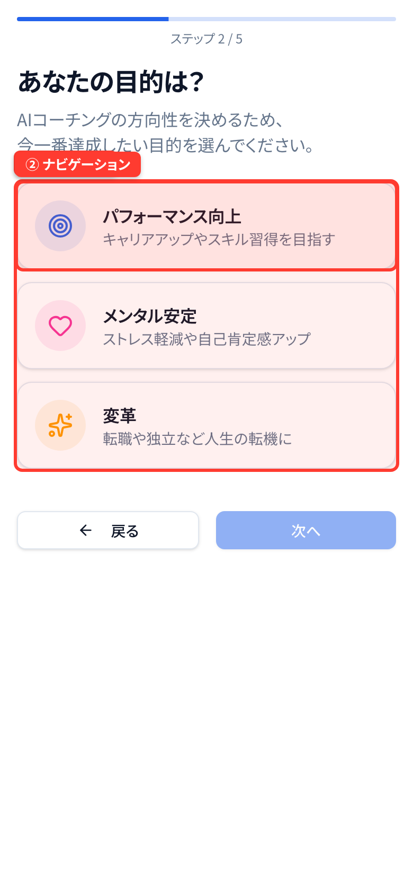

- ① **目的カード**: 3つの目的から1つを選択します
  - **パフォーマンス向上**: キャリアアップやスキル習得
  - **メンタル安定**: ストレス軽減や自己肯定感アップ
  - **変革**: 転職や独立など人生の転機
- ② **ナビゲーション**: 「戻る」「次へ」で移動します

### ステップ2: 目的を選択した状態

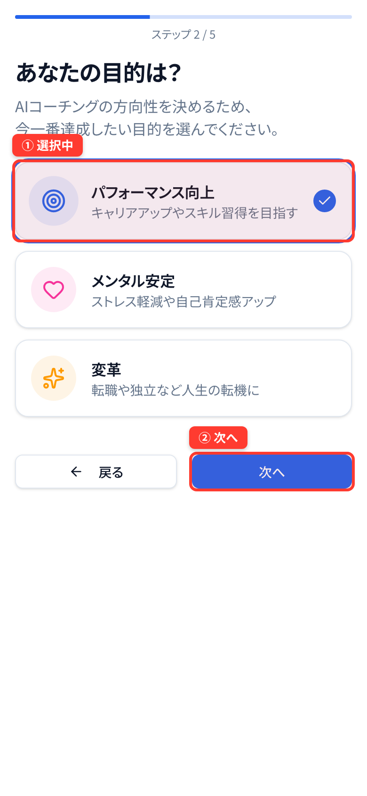

- ① **選択済みカード**: 選択した目的がハイライトされ、チェックマークが付きます
- ② **「次へ」ボタン**: 目的を選択すると有効化され、次のステップに進めます

### ステップ3: 価値観インタビュー

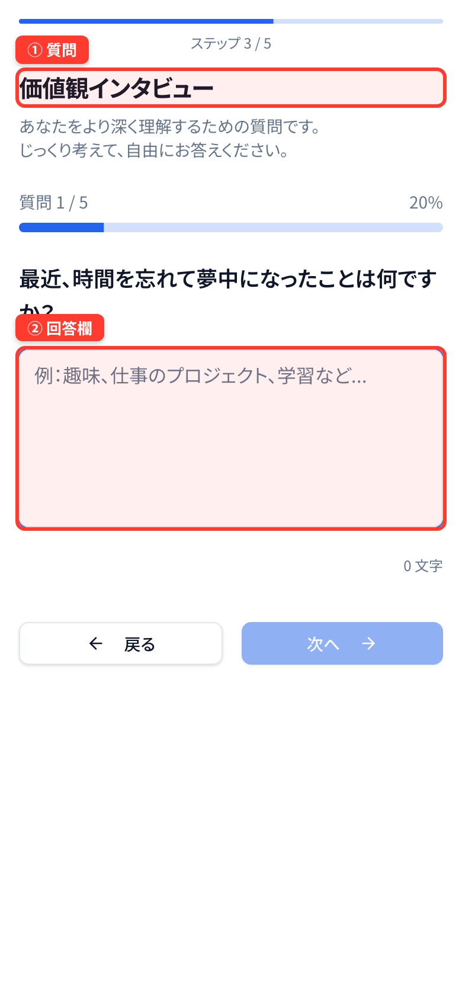

- ① **質問カード**: 5つの質問が順番に表示されます。質問番号で進捗が分かります
- ② **回答入力欄**: 自由記述で回答します。じっくり考えて入力してください

### ステップ4: 動機の深掘り

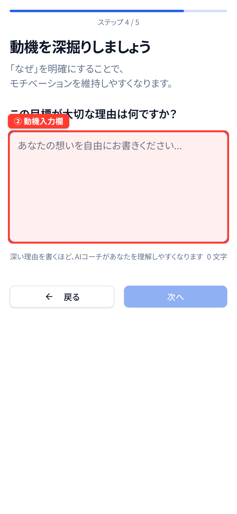

- ① **選択した目的の表示**: 前のステップで選んだ目的が確認できます
- ② **動機入力欄**: 「なぜその目的が大切か」を自由に記述します。深い理由を書くほどAIコーチの理解が深まります

### ステップ5: 完了

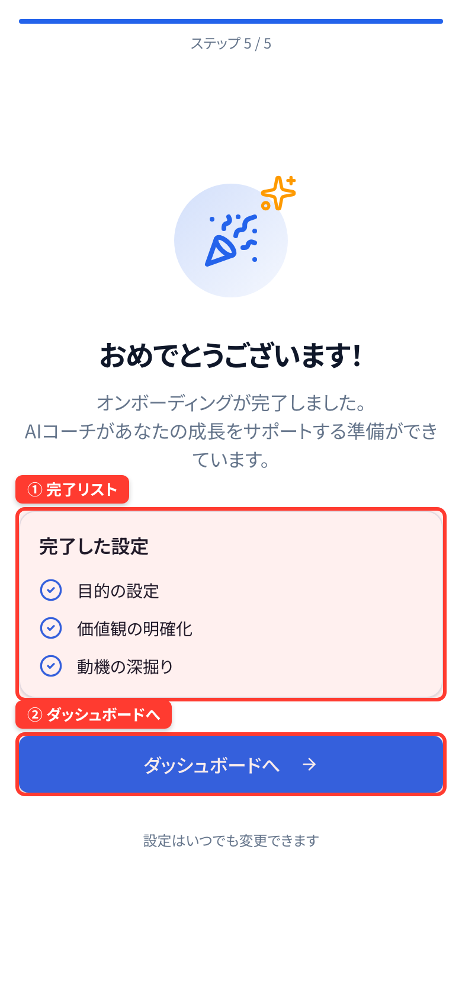

- ① **完了チェックリスト**: 設定した3つの項目（目的・価値観・動機）が完了済みで表示されます
- ② **「ダッシュボードへ」ボタン**: タップするとメイン画面に移動します

## 3. メイン機能

### ダッシュボード

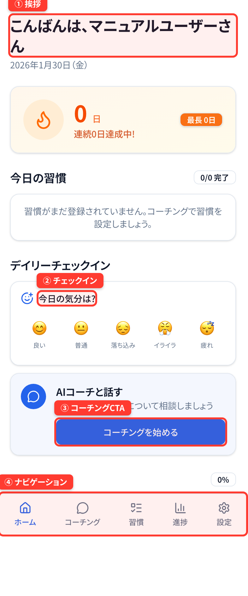

- ① **挨拶エリア**: ユーザー名と今日の日付が表示されます
- ② **デイリーチェックイン**: 「今日の気分は？」から気分を選択します
- ③ **コーチングCTA**: 「コーチングを始める」でAIコーチとの対話を開始します
- ④ **ナビゲーションバー**: 各機能（ホーム・コーチング・習慣・進捗・設定）に移動します

## 4. コーチング

### コーチングトップ

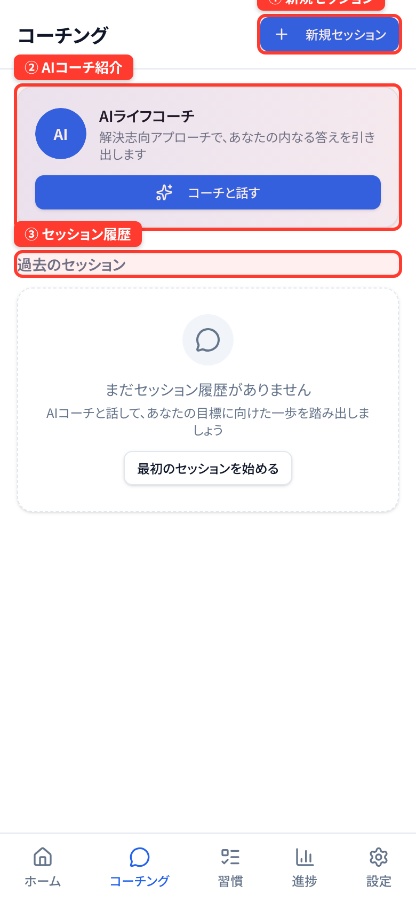

- ① **「新規セッション」ボタン**: 新しいコーチングセッションを開始します
- ② **AIコーチ紹介カード**: AIコーチの説明と「コーチと話す」ボタンがあります
- ③ **セッション履歴**: 過去のセッション一覧が表示されます

### チャット画面

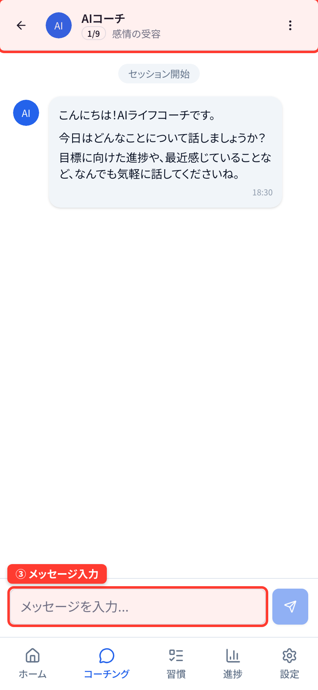

- ① **ヘッダー**: 現在のセッション情報（ステップ番号・テーマ）が表示されます
- ② **メッセージエリア**: AIコーチとの対話内容が表示されます
- ③ **入力欄**: メッセージを入力して送信ボタン（矢印）で送ります

## 5. 習慣管理

### 習慣一覧

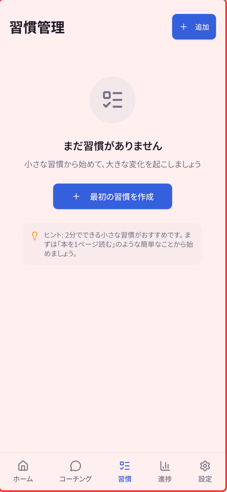

- ① **習慣リスト**: 登録した習慣が一覧表示されます。各習慣の達成状況が確認できます
- ② **新規作成**: 習慣がない場合は「コーチングで習慣を設定しましょう」のメッセージが表示されます

### 新規習慣作成

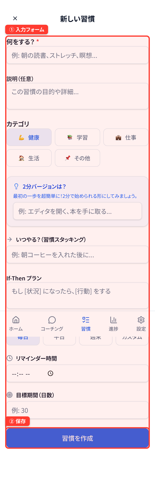

- ① **入力フォーム**: 習慣名・説明・頻度などの詳細を入力します
- ② **保存ボタン**: 入力後に保存して習慣を登録します

## 6. 進捗確認

### 進捗ページ

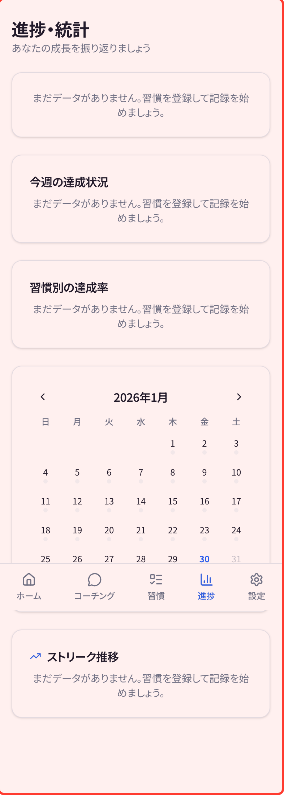

- ① **進捗サマリー**: 習慣の達成状況やストリーク（連続達成日数）を確認できます

## 7. 設定

### 設定ページ

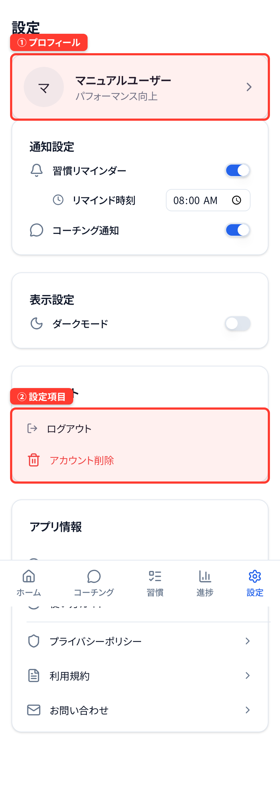

- ① **プロフィールセクション**: ユーザー名とアイコンが表示されます
- ② **設定項目**: 通知・ダークモード・アカウント情報などを変更できます

### プロフィール編集

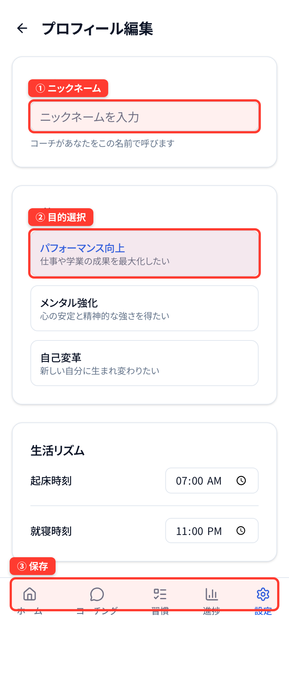

- ① **ニックネーム入力**: 表示名を変更できます
- ② **目的の変更**: オンボーディングで設定した目的を変更できます
- ③ **保存ボタン**: 変更を保存します

---

*最終更新: 2026/1/30*
